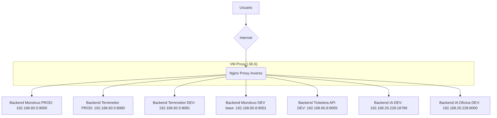

# Arquitectura del Sistema Monstruo (AS-IS)

Este documento describe la arquitectura actual del sistema, incluyendo el flujo de red, los componentes de software y un diagnóstico de los problemas de acoplamiento existentes.

Referencia operativa del proxy actual:
- [plataforma/docs/PROXY_INVERSO.md](/srv/monstruo_dev/plataforma/docs/PROXY_INVERSO.md)

## 1. Flujo de Red (Estado actual)

El flujo de una petición HTTP desde un usuario hasta un servicio de la aplicación sigue estos pasos:



**Descripción del Flujo actual:**

1. **Usuario:** Inicia una petición a un dominio como `ticketera.telconsulting.cl`.
2. **VM Proxy (`.60.6`):** Nginx recibe la petición pública y la enruta según familia de aplicación:
   - `monstruo.conf`
   - `terreneitor.conf`
   - `sapa.conf`
3. **PROD:** Usa `/` sin prefijo visible.
4. **DEV:** Usa `/dev/` como prefijo público obligatorio.
5. **Backends reales:** La VM proxy ya no debe asumirse como un simple passthrough a `:80`. Hoy enruta directamente a puertos concretos según servicio.

### Backends actuales publicados por el proxy

**Monstruo PROD**
- `ticketera.telconsulting.cl` -> `192.168.60.5:9000`
- `login.telconsulting.cl` -> `192.168.60.5:9000`
- `config.telconsulting.cl` -> `192.168.60.5:9000`

**Monstruo DEV**
- `base-dev` -> `192.168.60.8:9001`
- `ticketera-api-dev` -> `192.168.60.8:9005`
- `ia-dev` -> `192.168.20.228:18789`
- `ia-oficina-dev` -> `192.168.20.228:8000`

**Terreneitor**
- PROD -> `192.168.60.5:8080`
- DEV -> `192.168.60.5:8081`

## 2. Componentes Internos (Contenedores Docker)

El entorno de desarrollo (`monstruo-dev`) se compone de los siguientes servicios principales, orquestados por `docker-compose.yaml`:

*   `monstruo-dev-db` (Imagen: `postgres:16`)
    *   **Función:** Base de datos central para todas las aplicaciones.
*   `monstruo-dev-gateway` (Imagen: `monstruo_dev-gateway`)
    *   **Función:** Punto de entrada único, gestiona la autenticación de usuarios y redirige las peticiones a los servicios internos. Expone el puerto `9001`.
*   `monstruo-dev-ticketera` (Imagen: `monstruo_dev-ticketera`)
    *   **Función:** Aplicación principal para la gestión de tickets. Contiene toda la lógica de negocio relacionada.
*   **(Otros servicios):** El `docker-compose` está incompleto, pero existen otros servicios como `erp`, `crm`, `bodega`, etc., que siguen un patrón similar.

## 3. Diagnóstico de Acoplamiento y Deuda Técnica

El principal problema que impide la separación real de las aplicaciones es la **duplicación de la lógica de negocio en una librería compartida.**

*   **El Problema:** El directorio `plataforma/core/` contiene archivos de lógica de negocio que son específicos de un único servicio. Por ejemplo:
    *   `plataforma/core/tickets_service.py`
    *   `plataforma/core/bodega_service.py`
    *   `plataforma/core/crm_service.py`
*   **La Duplicación:** Al mismo tiempo, existen copias (en la mayoría de los casos, idénticas) de estos archivos dentro de sus respectivas aplicaciones. Por ejemplo, `ticketera/service.py`.
*   **El Riesgo:**
    1.  **Mantenimiento Doble:** Un cambio en `ticketera/service.py` debe replicarse manualmente en `plataforma/core/tickets_service.py`, lo cual es propenso a errores y olvidos.
    2.  **Acoplamiento Fuerte:** Aunque no se detectaron importaciones directas *entre* servicios, el hecho de que toda la lógica de negocio esté disponible en una librería compartida (`core`) hace trivial que un desarrollador importe `from core import crm_service` dentro de la `ticketera`, rompiendo el aislamiento de microservicios y creando dependencias ocultas.
    3.  **Falta de Claridad:** No queda claro cuál es la "fuente de la verdad" para la lógica de un servicio, si el archivo local o el archivo en `core`.

**Conclusión:** Para lograr una arquitectura de microservicios limpia y escalable, es imperativo eliminar esta duplicación y asegurar que la lógica de cada servicio resida únicamente dentro de su propio dominio (su directorio de aplicación).

---

# Fase 2: Arquitectura Futura (TO-BE)

Esta sección describe la arquitectura ideal propuesta y el plan para alcanzarla.

## 1. Diseño de VM Ideal (Desarrollo y Producción)

El objetivo es tener dos entornos idénticos y aislados en Proxmox, cada uno con una configuración simple y robusta.

*   **Proxy Inverso Único por VM:** Objetivo futuro: que cada entorno tenga su propio proxy local y eliminar dependencia operativa del proxy compartido en `.60.6`.
*   **Contenedores de Aplicación Aislados:** Las aplicaciones (`gateway`, `ticketera`, `db`, etc.) correrán en contenedores Docker, con su código fuente refactorizado para eliminar dependencias a nivel de ficheros.
*   **Comunicación Exclusiva por API:** La comunicación entre servicios se realizará únicamente a través de llamadas HTTP, orquestadas por el `gateway`.

## 2. Plan de Refactorización de Código

El núcleo de la separación de servicios se logra con la siguiente refactorización:

1.  **Mover Lógica de Negocio:** Para cada servicio (`ticketera`, `bodega`, etc.), la lógica de negocio será movida desde `plataforma/core/` a la carpeta raíz del servicio. Por ejemplo, el contenido de `plataforma/core/tickets_service.py` se moverá a `ticketera/service.py` (verificando que sean idénticos antes de eliminar el de `core`).
2.  **Corregir Importaciones:** Dentro del código de cada aplicación, se ajustarán las importaciones para que apunten a su `service.py` local (ej: `import service as tickets_service`) en lugar de a la librería compartida (`from core import ...`).
3.  **Limpieza de `core`:** Se eliminarán los archivos de servicio duplicados de `plataforma/core/`, dejando únicamente el código verdaderamente transversal (`db.py`, `security.py`, `middleware.py`, etc.).

## 3. Configuración Nginx Simplificada (Plantillas)

Se crearán plantillas de configuración de Nginx para cada entorno, siguiendo los requisitos de ruteo.

*   **VM de Producción (Ruteo por Subdominio):**
    ```nginx
    # /etc/nginx/sites-available/produccion.conf
    server {
        listen 443 ssl;
        server_name ticketera.telconsulting.cl;

        # ... config SSL ...

        location / {
            proxy_pass http://ticketera_container:9005; # Puerto del servicio de ticketera
            # ... headers de proxy ...
        }
    }

    server {
        listen 443 ssl;
        server_name erp.telconsulting.cl;
        # ... otro servicio ...
    }
    ```

*   **VM de Desarrollo (Ruteo por Prefijo `/dev/`):
    ```nginx
    # /etc/nginx/sites-available/desarrollo.conf
    server {
        listen 443 ssl;
        server_name dev.telconsulting.cl; # Un dominio genérico para desarrollo

        # ... config SSL ...

        location /dev/ {
            proxy_pass http://gateway_dev_container:9001; # Apunta siempre al gateway de desarrollo
            proxy_set_header X-Forwarded-Prefix /dev;
            # ... otros headers de proxy ...
        }
    }
    ```
